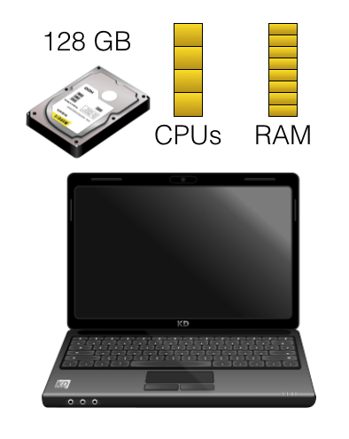
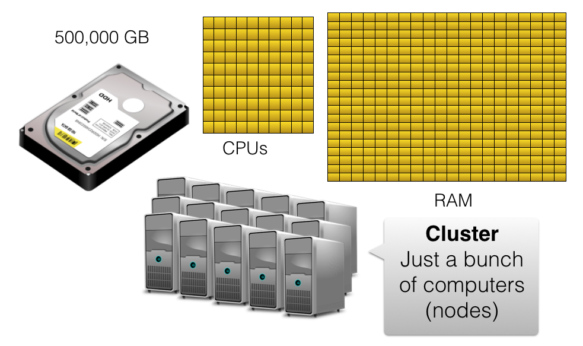
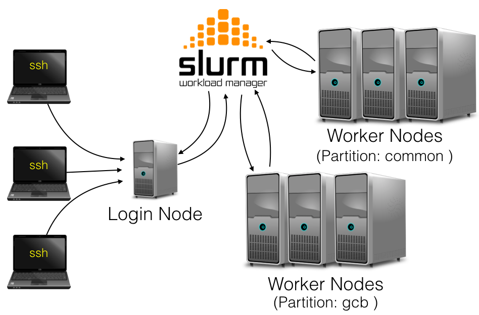

### Laptop Not Powerful Enough

For running bioinformatic workflows a laptop may 
- take forever to finish running
- run out of RAM(Memory) and crash
- not have enough disk space to store the data

## Cluster Has More Power

## Cluster Organization

