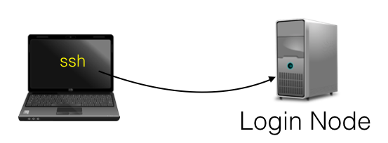
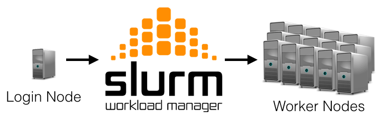

### Connecting to the cluster

On your laptop open your terminal program.
Type the following command replacing &lt;netid&gt; with your own netid.
~~~~
ssh <netid>@dscr-slogin-01.oit.duke.edu
~~~~
{: .bash}
You will then be prompted for your password. Once you enter it correctly you should be 
presented with the command prompt for the cluster.
~~~~
password:XXXXX
...
...slogin-01  ~ $
~~~~
{: .output}

### Run a Job

To run a job on the cluster you can use the `srun` command. 
This will tell __Slurm__ to run your job in the foreground.
For this example we will could the words in a text file called `/etc/hosts`.
Type the following command:
~~~~
srun wc /etc/hosts
~~~~
{: .bash}
You should see the following output:
~~~
srun: job 51 queued and waiting for resources
srun: job 51 has been allocated resources
2  10 158 /etc/hosts
~~~
{: .output}

